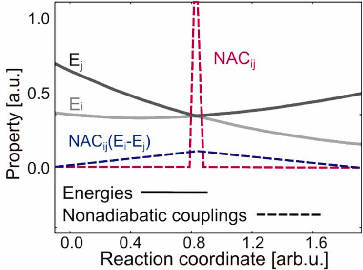

=======================
Excited State Dynamics
=======================

.. _es-dynamics:

Introduction
--------------

In the field of computational chemistry, excited state dynamics simulations are powerful tools that provide 
captivating insight into the dynamic world of molecules in their electronically excited states. 
These simulations decipher the intricate interplay of electronic and nuclear motions and shed light on the 
fascinating behaviour of molecules as they transition between various electronic states. 
By using the principles of quantum mechanics and advanced computational techniques, simulations of the excited 
state dynamics offer an opportunity to study the behaviour of molecules that occur upon light absorption.

In surface hopping molecular dynamics simulations, time-dependent molecular information is acquired at each time step. 
This includes nuclear coordinates and electronic state populations, along with the energies and forces of all electronic states, 
and their nonadiabatic couplings throughout the simulation. 
In this context, we will now present the various types of data that can be utilized as features when training machine learning models.

  - :ref:`Molecular Structure <section-struc>`
  - :ref:`Energies <section-energies>`
  - :ref:`Forces <section-forces>`
  - :ref:`Nonadiabatic couplings <section-nacs>`
  - :ref:`Dipoles <section-dipoles>`
  
..
  _Excited state dynamics simulations offer a powerful lens into the intricate world of molecular interactions during electronic transitions. This computational technique provides valuable insights into how molecules navigate various energy states, shedding light on phenomena like photochemistry and photophysics.

Molecular Structures: The Building Blocks
----------------------------------------------
.. _section-struc:

The molecular structures in the surface hopping trajectories in SHARC are described by the Cartesian coordinates of the nuclear positions. 
However, these Cartesian coordinates lack a unique definition since they rely on the user's choices regarding the initial position and orientation of the molecules in Euclidean space. 
Consequently, to ensure translational and rotational invariance during machine learning model training, a transformation of the Cartesian coordinates into a machine-learnable representation becomes necessary. 
**SPaiNN** facilitates this transformation and enables an interface with the representations available in `SchNetPack 2.0 <https://doi.org/10.1063/5.0138367>`_, 
specifically :ref:`SchNet <subsec-schnet>` and :ref:`PaiNN <subsec-painn>`.

The inputs for both representations are the nuclear charges :math:`\mathrm{Z}_i \in \mathbb{N}` and positions :math:`r_i \in \mathbb{R}^3` for each atom :math:`i`.
In both, :ref:`SchNet <subsec-schnet>` and :ref:`PaiNN <subsec-painn>` representation, the invariant atomistic representations are initialised with learned embeddings per atom type, namely :math:`s_i^0 = \mathbf{a}_{\mathrm{Z}_i} \in \mathbb{R}^{F\times 1}`.
:math:`F` refers to the number of features (typically: 265) and is kept constant all over the network.

SchNet
^^^^^^^^^
.. _subsec-schnet:

SchNet makes use of continuous convolutional filters for inter-atomic distances and applies skip connections between node updates.
Within this representation the contributions of each atom embedded in its chemical environment (:math:`s_i \in \mathbb{R}^{F\times 1}`) is considered to be a rotationally invariant scalar.
Consequently, when learning potential energy surfaces, SchNet provides energy predictions that are *invariant* to rotations and force predictions that are *equivariant* to rotations.
The latter stems from the fact, that forces are learned as negative gradient of the respective potential energy of each electronic state (:math:`j`) with respect to the nuclear positions of each atom (:math:`i`).

.. math::

  \mathbf{F}_{i} = -\frac{\partial E_{ji}}{\partial\mathbf{R_{i}}}

#. Schütt, Arbabzadah, Chmiela, Müller, Tkatchenko: Quantum-chemical insights from deep tensor neural networks, *Nat. Comm.* **2017**, 8, 13890, DOI `10.1038/ncomms13890 <https://doi.org/10.1038/ncomms13890>`_.
#. Schütt, Kindermans, Sauceda, Chmiela, Tkatchenko, Müller: SchNet: A continuous-filter convolutional neural network for modeling quantum interactions, *Advances in Neural Information Processing Systems* **2017**, 992-1002, `PDF <https://proceedings.neurips.cc/paper/2017/file/303ed4c69846ab36c2904d3ba8573050-Paper.pdf>`_.
#. Schütt, Sauceda, Kindermans, Tkatchenko, Müller: SchNet - a deep learning architecture for molceules and materials, *JCP* **2018**, 148 (24), 241722, DOI `10.1063/1.5019779 <https://doi.org/10.1063/1.5019779>`_.

PaiNN
^^^^^^^^^
.. _subsec-painn:

The PaiNN representation refers to the polarizable atom interaction neural network.
The unique feature of PaiNN lies in the fact that it can interpret invariant and equivariant atomwise representations.
Hence, the atomwise contributions within a chemical environment can be either represented by invariant scalars (:math:`s_i \in \mathbb{R}^{F\times 1}`) or equivariant vectors (:math:`\mathbf{v}_i \in \mathbb{R}^{F\times 3}`).
Similar to SchNet, PaiNN utilizes continuous-filter convolutions at the feature level, incorporating rotationally-invariant filters formed by a fusion of radial basis functions and cosine cutoff filters.
PaiNN, like SchNet, delivers rotationally *invariant* energy predictions and rotationally-*equivariant* force predictions (gradient of energy, see :ref:`above <subsec-schnet>`).
Furthermore, PaiNN enables the forecasting of tensorial properties, such as dipole moments and nonadiabatic couplings, which exhibit *rotational equivariance*.

#. Schütt, Unke, Gastegger: Equivariant message passing for the prediction of tensorial properties and molecular spectra, *ICML* **2021**, `PDF <http://proceedings.mlr.press/v139/schutt21a/schutt21a.pdf>`_.

Energies: Illuminating Potential Transitions
----------------------------------------------
.. _section-energies:
  
In surface hopping simulations, energies take center stage as they dictate the fate of a molecule's electronic state. 
Quantum mechanical calculations determine the potential energy surfaces for different electronic states, guiding the system's behavior. 
The hopping algorithm enables the molecule to transition between these surfaces, 
capturing events like absorption and emission of light. 
These transitions influence the overall dynamics and hold the key to understanding photochemical processes.

Forces: Navigating the Landscape
---------------------------------
.. _section-forces:

Forces play a pivotal role in steering molecular motion during electronic transitions. 
By calculating forces on the atoms within different electronic states, surface hopping simulations depict how molecules respond to changes in their environment. 
The dynamic interplay between forces and electronic states governs the trajectories and pathways the system explores, offering valuable insights into reaction mechanisms and energy redistribution.

Non-adiabatic Couplings: Bridging the States
---------------------------------------------
.. _section-nacs:

Non-adiabatic couplings (NACs) serve as bridges connecting distinct electronic states. 
These couplings quantify the probability of transitioning from one state to another, guiding the surface hopping algorithm's decisions. Calculated from derivatives of electronic wavefunctions, NACs enable the simulation to capture transitions between states, influencing the molecule's behavior. 
The accurate representation of NACs is crucial for capturing complex excited state dynamics and understanding 
energy flow.

Non-adiabatic couplings :math:`C_{ij}` (see red line in :ref:`img-NAC`) are very sharp and have a singularity when two potential energy surfaces (:math:`E_{i}` and :math:`E_{j}`) are getting close in energy and are coupled. 
This means, when a molecule moves on the upper surfaces and approaches an avoided crossing point (conical intersection), large non-adiabatic couplings can lead to a transition to the lower potential energy surface.

The nonadiabatic couplings are inverse proportional to the energy gap:

.. math::

  C_{ij} = \frac{\lbrace\Psi_i(\mathbf{R}) | \nabla_\mathbf{R}\hat{H}_{el} | \Psi_j(\mathbf{R})\rbrace}{E_j - E_i} ~~~~\text{for}~~j > i

.. _img-NAC:

  Figure: NACs

Dipoles: Illuminating Transition Probabilities
-----------------------------------------------
.. _section-dipoles:

Dipoles, especially transition dipoles, offer a glimpse into the transition probabilities between electronic states. 
These dipoles describe the molecule's propensity to absorb or emit light during state transitions. 
Calculated from the electronic wavefunctions, transition dipoles provide insights into the intensity and directionality of electronic transitions. 
Incorporating dipoles in surface hopping simulations enhances our understanding of light-matter interactions and aids in predicting experimental observables.

