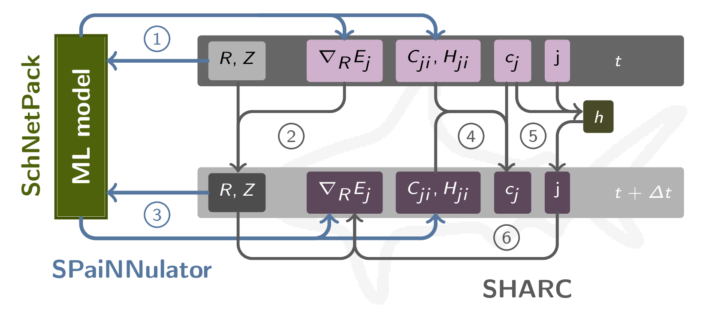

========================================
Interface between SchNetPack and SHARC
========================================
.. _usage_interface:

SHARC-Interface
----------------
.. _05_interface:

...

Figure 1: Overview of the calculations conducted in a single iteration from time :math:`t` to :math:`t+\Delta{t}`) within a surface hopping simulation while connecting `SchNetPack 2.0    <https://github.com/atomistic-machine-learning/schnetpack/tree/master>`_ (a machine learning model) with `SHARC 3.0 <https://www.sharc-md.org/>`_ through **SPaiNN** (:py:class:`SPaiNNulator`). These stages encompass: (1) the anticipation of energies (in matrix :math:`H_{ji}`), gradients (:math:`-\nabla_{\mathbf{R}}E_j`), and couplings (:math:`\mathbf{C}_{ji}`) for the configuration (:math:`\mathbf{R}, Z`) at time-point :math:`t` *via* the ML model; (2) the adjustment of atomic positions :math:`\mathbf{R}`; (3) the prognostication of energies, forces, and couplings for the revised configuration *via* the ML model; (4) the progression of electronic coefficients :math:`c_j`; (5) the computation of hopping probabilities :math:`h` followed by a stochastic selection of the new active state :math:`j`; and (6) the computation of the gradient for the newly designated active state, set for employment in the subsequent iteration. For more details see `10.1002/9781119417774.ch16 <https://dx.doi.org/10.1002/9781119417774.ch16>`_.
